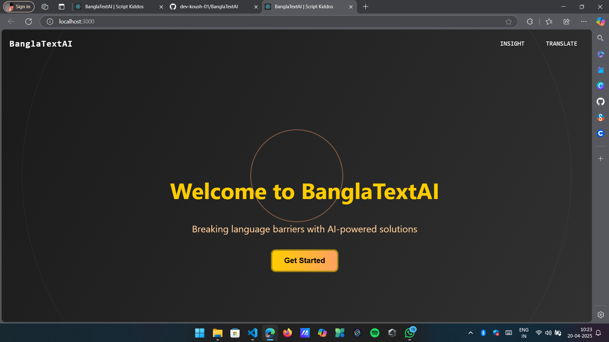
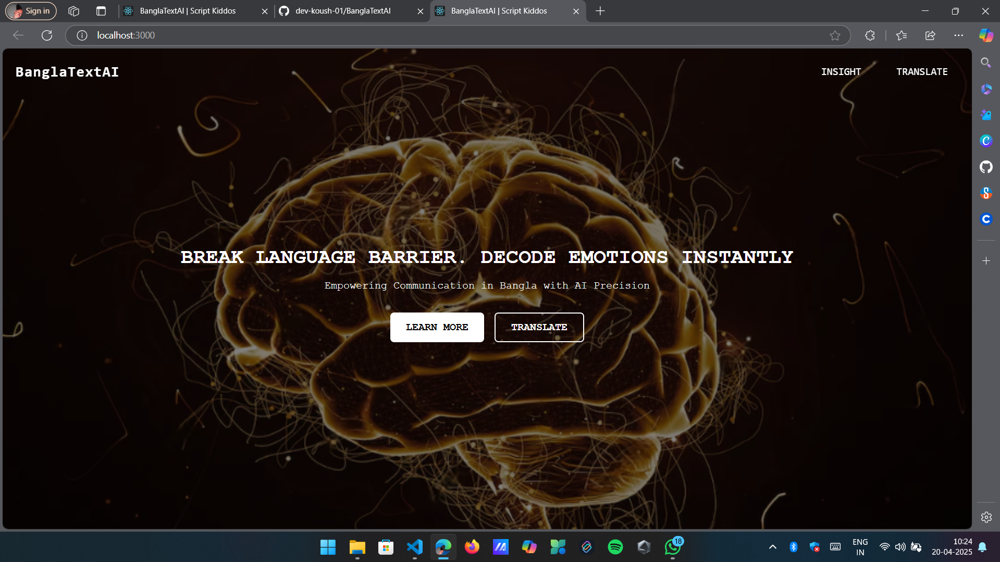
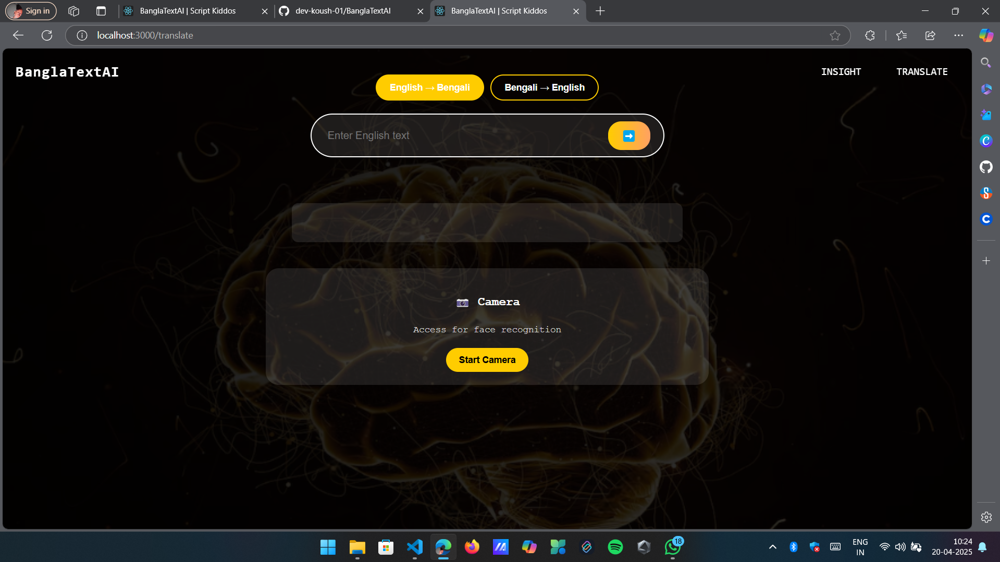
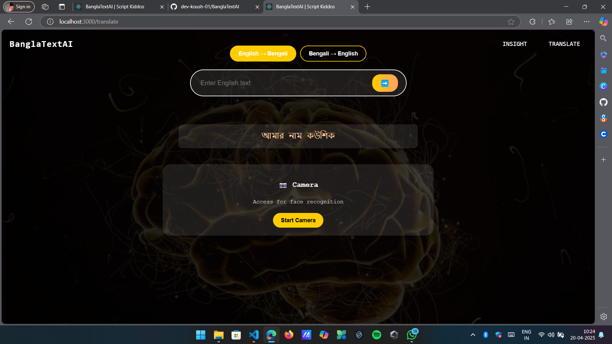
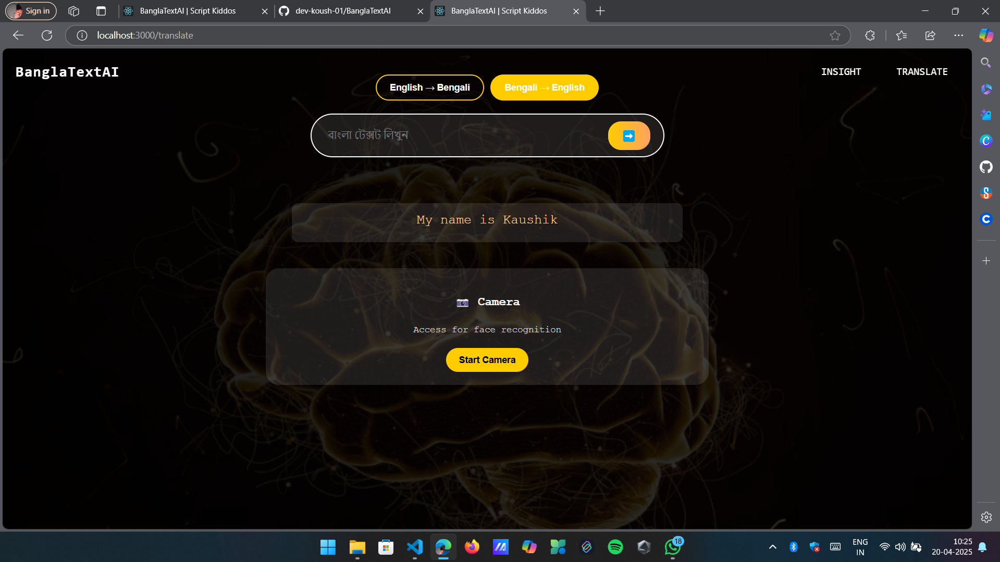

# BanglaTextAI

A React and Flask-based application for English-Bengali translation with emotion detection, built for Hack4Bengal hackathon.

## Features & Screenshots
- Real-time English-Bengali translation
- Facial emotion detection with ML
- Interactive UI with animations
- Live camera integration for face detection

### Application Flow
1. **Landing Page**

*Main interface of BanglaTextAI*

2. **Getting Started**

*Initial setup and instructions*

3. **Website Overview**

*Complete application interface*

### Translation Features
1. **English to Bengali**

*Translate from English to Bengali*

2. **Bengali to English**

*Translate from Bengali to English*

### Emotion Detection

*Real-time facial emotion recognition*

## Tech Stack
- Frontend: React.js
- Backend: Flask
- ML: TensorFlow, OpenCV
- Translation: Google Translate API

## ML Architecture & Dataset
- **Model**: Custom CNN architecture trained on FER2013 dataset
- **Dataset**: [FER2013](https://www.kaggle.com/datasets/msambare/fer2013) (Facial Expression Recognition Dataset)
  - 35,887 grayscale images
  - 7 emotion classes: angry, disgust, fear, happy, neutral, sad, surprise
  - Image size: 48x48 pixels
- **Training**: TensorFlow/Keras implementation
- **Accuracy**: 0.8043 on validation set

### Model Performance

*Validation accuracy achieved during model training*

## Setup

### Frontend Setup
1. Clone the repository
2. Install Node.js dependencies:
   ```bash
   npm install
   ```

### Backend Setup
1. Navigate to backend directory:
   ```bash
   cd BackendEmotion
   ```

2. Install Python dependencies:
   ```bash
   pip install flask flask-cors opencv-python tensorflow numpy googletrans==3.1.0a0
   ```

3. Additional Node.js dependencies for backend:
   ```bash
   npm install cors express express-fileupload multer
   ```

## Running the Application

1. Start Flask backend:
   ```bash
   cd BackendEmotion
   python predict.py
   ```

2. Start React frontend (in new terminal):
   ```bash
   npm start
   ```

3. Open http://localhost:3000 in your browser

## Credits
- **Dataset**: FER2013 by Pierre-Luc Carrier and Aaron Courville
- **ML Implementation**: Based on research paper "Challenges in Representation Learning: A report on three machine learning contests" by Ian J. Goodfellow et al.
- **Framework**: TensorFlow/Keras

## Team
Script Kiddos - Hack4Bengal Hackathon 2025

